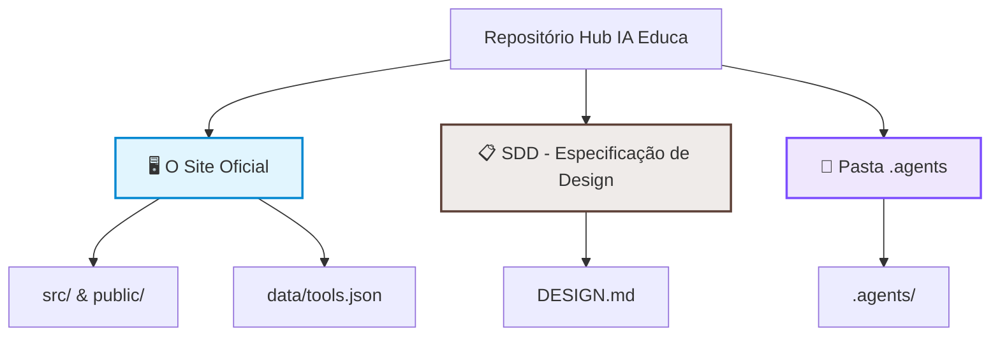

# 🚀 Hub IA Educa – Manual de Transição e Documentação

> Bem-vindo(a) ao repositório do **Hub IA Educa**! Este guia foi feito especialmente para você que está assumindo a liderança ou a colaboração deste projeto, mesmo que não seja da área de programação. Aqui você aprenderá como manter o site atualizado e como hospedá-lo no domínio oficial do SENAI.

---

## 🗺️ 1. O que é cada parte do repositório? (Mapa Visual)

Para quem não é programador, o repositório pode parecer confuso. Aqui está um resumo simples do que cada pasta faz e se você precisa se preocupar com ela:



### 🖥️ O que faz parte do Site (Para Servir aos Usuários)
* **`data/tools.json`**: ⚠️ **Esta é a parte mais importante para você!** É o arquivo onde fica a lista de todas as ferramentas de IA do site. Atualizar o site significa simplesmente editar este arquivo.
* **`src/` e `public/`**: Contêm as telas, imagens e o código visual do site. Apenas desenvolvedores precisam mexer aqui.
* **`package.json` e arquivos de configuração**: Configurações internas de bibliotecas. Não toque neles a menos que saiba o que está fazendo.

### 📋 O que é a SDD (`DESIGN.md`)?
* **`DESIGN.md`**: É o nosso **Documento de Especificação de Design (Software Design Document - SDD)**. Ele define as cores oficiais do SENAI (Azul `#164194` e Laranja `#E84910`), as fontes, os tamanhos dos botões e as regras de como o site deve se parecer. Se no futuro um desenvolvedor for criar uma nova página, ele **deve** seguir as regras deste arquivo para manter a marca SENAI consistente.

### 🤖 O que é a pasta `.agents`?
* **`.agents/`**: Esta pasta é **exclusiva para assistentes de Inteligência Artificial** (como o Antigravity). Ela contém instruções, regras e memórias que a IA usa para nos ajudar a programar. **Ela NÃO faz parte do site** e não é enviada para os usuários. Pessoas não-técnicas podem ignorar completamente esta pasta.

---

## ✍️ 2. Como Atualizar as Ferramentas de IA (Sem Saber Programar)

Adicionar novas ferramentas é muito simples e pode ser feito de duas formas: diretamente pelo navegador no GitHub (sem instalar nada) ou no seu computador.

### Passo 1: Gerar as informações da ferramenta com IA
Abra a sua IA de preferência (ChatGPT, Claude ou Perplexity) e copie e cole o seguinte comando (ajustando o nome da ferramenta):

> [!TIP]
> **Prompt para copiar e enviar à IA:**
> ```markdown
> Pesquise sobre a ferramenta de IA: [COLOQUE O NOME DA FERRAMENTA AQUI]
> 
> Retorne EXATAMENTE neste formato JSON (sem markdown, sem explicações):
> 
> {
>   "id": "nome-da-ferramenta-em-minusculo-separado-por-traco",
>   "name": "Nome Exato",
>   "jobToBeDone": "Descrição curta do que ela faz (máximo 12 palavras)",
>   "screenshotUrl": "URL de uma imagem 16:9 ou logo da ferramenta",
>   "url": "Link oficial da ferramenta",
>   "tags": {
>     "lessonPhase": ["Escolha entre: ideação, produção, avaliação, planejamento"],
>     "outputFormat": ["Escolha entre: texto, imagem, vídeo, áudio, código, dados"],
>     "costType": "Escolha um: Gratuita, Freemium, Paga ou Código Aberto"
>   },
>   "tip": "Dica pedagógica prática para um professor do SENAI (máximo 20 palavras)"
> }
> ```

### Passo 2: Adicionar ao arquivo `data/tools.json`
Você pode fazer isso **diretamente no site do GitHub**:
1. Navegue até o arquivo `data/tools.json` no GitHub.
2. Clique no ícone de lápis ✏️ (Editar este arquivo).
3. Vá até o final do arquivo, adicione uma vírgula ( `,` ) após a chave de fechamento da última ferramenta existente e cole o código JSON gerado pela IA.
4. Clique em **Commit changes...** (Salvar alterações) no canto superior direito para gravar.

> [!WARNING]
> **Regras de Ouro para Não Quebrar o Site:**
> - O campo `jobToBeDone` não pode ter mais que **12 palavras**.
> - O campo `tip` (Dica) não pode ter mais que **20 palavras**.
> - As palavras nos filtros devem ser escritas exatamente como listadas (ex: `ideação` com acento, tudo em minúsculo).
> - Se você errar alguma regra, a validação automática do GitHub impedirá que a alteração vá ao ar e avisará onde está o erro.

---

## 🌐 3. Como Hospedar o Site em um Domínio Próprio do SENAI

Como o site é **estático** (composto apenas por arquivos HTML, CSS e JavaScript que não mudam no servidor), ele é extremamente leve e barato de hospedar. Existem dois caminhos recomendados para colocar o site no ar com o domínio do SENAI (ex: `iaeduca.senai.br` ou `iaeduca.sc.senai.br`):

### Caminho A: Hospedagem via Vercel (Recomendado e mais rápido)
Atualmente o projeto já está pré-configurado para a **Vercel**, que faz builds e deploys automáticos a cada alteração no GitHub.

1. **Vincular o GitHub**: Acesse o painel da Vercel e importe este repositório.
2. **Adicionar o Domínio**: 
   - No painel do projeto na Vercel, vá em **Settings** (Configurações) > **Domains** (Domínios).
   - Digite o domínio desejado (ex: `iaeduca.senai.br`) e clique em **Add**.
3. **Configuração de DNS (Ação com a equipe de TI do SENAI)**:
   - A Vercel exibirá um registro do tipo `CNAME` ou `A`.
   - Você deve encaminhar esses dados para a equipe de Tecnologia da Informação (TI) do SENAI que gerencia o domínio principal.
   - Solicite que eles criem um apontamento DNS:
     * **Tipo**: `CNAME`
     * **Nome/Host**: `iaeduca` (ou o subdomínio escolhido)
     * **Destino/Valor**: `cname.vercel-dns.com`
4. **Pronto!** Assim que o DNS propagar, a Vercel gerará o certificado de segurança (HTTPS) automaticamente e o site estará ativo.

### Caminho B: Hospedagem em Servidor Próprio do SENAI (On-Premises / IIS / Apache / Nginx)
Se a política de TI do SENAI exigir que o site rode dentro dos servidores físicos ou na nuvem privada da própria instituição:

1. **Gerar os arquivos estáticos**:
   - No terminal do projeto, execute o comando de compilação:
     ```bash
     npm run build
     ```
   - Isso gerará uma pasta chamada `dist` na raiz do projeto.
2. **Copiar os arquivos**:
   - Copie todo o conteúdo de dentro da pasta `dist/` (que contém os arquivos compilados HTML, CSS, JS e imagens).
   - Cole-o na pasta pública do servidor web do SENAI (por exemplo, no diretório `wwwroot` se for IIS Windows, ou `/var/www/html` se for Linux Nginx/Apache).
3. **Apontar o Domínio**:
   - Solicite à equipe de TI do SENAI que aponte o domínio desejado (DNS tipo A ou CNAME) para o endereço IP ou nome de host desse servidor web.

---

## 🛠️ 4. Guia Rápido para Desenvolvedores (Se precisar de ajuda técnica)

Se você precisar contratar ou pedir ajuda a um desenvolvedor para mudar o visual ou adicionar funcionalidades, passe estas instruções para ele:

### Instalação
```bash
# Instalar dependências
npm install
```

### Comandos de Desenvolvimento
```bash
# Iniciar o site em modo de desenvolvimento local (http://localhost:4321)
npm run dev

# Validar as regras de palavras e URLs das ferramentas no tools.json
npm run validate

# Gerar build estática para produção (pasta dist)
npm run build

# Executar testes unitários (Vitest)
npm run test
```

### Diretrizes de Código e Git
* **Commits Atômicos**: Cada alteração lógica deve corresponder a um único commit. Os commits devem seguir a convenção de [Conventional Commits](https://www.conventionalcommits.org/) em inglês (ex: `feat: add new filter options`, `fix: correct card padding`).
* **Design e Cores**: Siga rigorosamente as diretrizes visuais em [DESIGN.md](file:///workspaces/site_iaeduca/DESIGN.md) e [docs/diretrizes-design.md](file:///workspaces/site_iaeduca/docs/diretrizes-design.md).

---

Desejamos muito sucesso na continuidade deste projeto incrível para os educadores e alunos do SENAI! 🚀